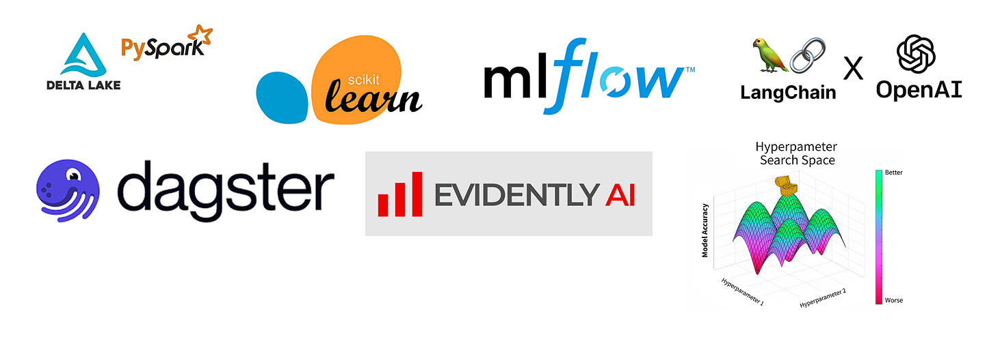

# End-to-End-Predictive-Maintenance-ETL-with-GenAI

A comprehensive end-to-end solution for real-time wind turbine monitoring, fault detection, and AI-assisted maintenance operations. This project combines modern data engineering practices, machine learning, and generative AI to create a robust predictive maintenance system.

## 🚀 Overview

This project processes real-time turbine sensor data, predicts equipment faults, and provides AI-powered maintenance support through a user-friendly interface.

### 🔧 Key Components

- **Real-Time Ingestion**: Spark Structured Streaming + Delta Lake  
- **ML Pipeline**: Scikit-learn, Hyperopt, MLflow, Evidently  
- **AI Assistant**: LangChain + OpenAI for maintenance support  
- **Frontend**: Streamlit UI with real-time chat  
- **Orchestration**: Dagster for automated workflows  

## 🧱 Architecture Summary

1. **Data Layer**: Ingest real-time sensor data → store in Delta Lake  
2. **ML Pipeline**: Train, evaluate, and monitor models  
3. **GenAI Assistant**: Answer maintenance queries via natural language  
4. **UI**: Streamlit app for user interaction  
5. **Scheduling**: Dagster pipelines for automation  

## 💻 Tech Stack

- **Data**: Apache Spark, Delta Lake  
- **ML**: scikit-learn, MLflow, Hyperopt  
- **AI**: LangChain, OpenAI GPT  
- **UI**: Streamlit  
- **Orchestration**: Dagster  
- **Monitoring**: Evidently  
- **Planned**: Power BI dashboard  

## 📈 Data Flow

1. Sensor data ingested in real-time  
2. Stored and processed in Delta Lake  
3. ML models trained and evaluated  
4. GenAI assistant handles maintenance queries  
5. Results displayed via Streamlit UI  
